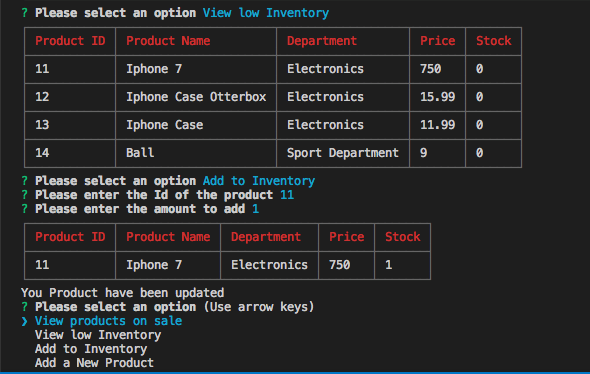
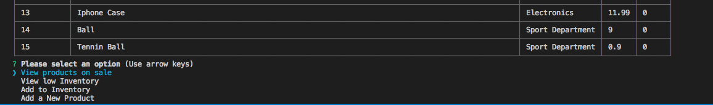

# bamazon
Virtual Store using NODE and Mysql

The bamazon solution is oriented a have a virtual store. The purpose is to have the user to buy, add, and update products.
The solution work only on the console.

# Technologies used

* node.js
* javascript
* npm pachages 
* clie-tables
* mysql
* clie- color
* inquirer
* Promises

## PRE-requirements

* node.js
* Mysql

## Installation

After downloading the Gib, the user has to open de console and press:

`npm install`

This would install all the packages required to work

# Description

In order to start the solution user have to type:

`node bamazonCustomer.js`

## First Menu

This menu shows the customer the table with all the products, prices, quantities,  and department.
The prompt would ask the customer for the ID he wants to buy and the quantities.
After the selection, the prompt would result in the confirmation and the amount bought. If there is no availability the system would not let the customer buy and give an error.

All these procedures are queries from the database and updated the database.

## Manager User

The manager setup would let the user choose this different option:
* View product of Sales
* View low inventory
* Add quantity to the inventory
* Add a new product 

View product on sale, would query all the product 

## Product with Low Inventory 

Would show the product with stock on 0

## Add Quatities

After adding a to the stock , the system would Query the product updated

## Add a new Product

Add a new product, would ask to the user for the description, the price and the department.

#DATABASE

The solution user MySql to store all the data. Update and query requirement from the user.
I use two databases:
* product
* department

